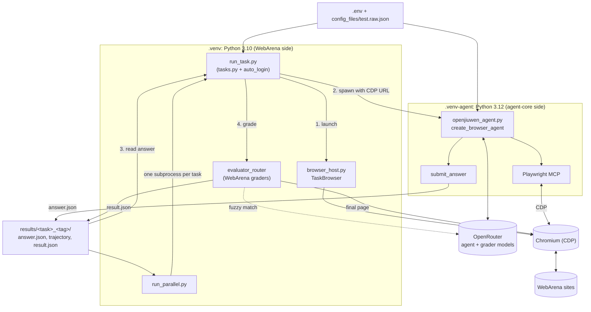

# jiuwen_arena architecture

```mermaid
flowchart TB
    CFG[".env + config_files/test.raw.json"]

    subgraph PARENT[".venv: Python 3.10 (WebArena side)"]
        RP["run_parallel.py"]
        RT["run_task.py<br/>(tasks.py + auto_login)"]
        BH["browser_host.py<br/>TaskBrowser"]
        EV["evaluator_router<br/>(WebArena graders)"]
    end

    subgraph CHILD[".venv-agent: Python 3.12 (agent-core side)"]
        OA["openjiuwen_agent.py<br/>create_browser_agent"]
        MCP["Playwright MCP"]
        SA["submit_answer"]
    end

    CHROME[("Chromium (CDP)")]
    SITES[("WebArena sites")]
    LLM[("OpenRouter<br/>agent + grader models")]
    OUT["results/&lt;task&gt;_&lt;tag&gt;/<br/>answer.json, trajectory, result.json"]

    CFG --> RT
    CFG --> OA
    RP -->|"one subprocess per task"| RT
    RT -->|"1. launch"| BH --> CHROME
    RT -->|"2. spawn with CDP URL"| OA
    OA --> MCP <-->|"CDP"| CHROME <--> SITES
    OA --> SA
    OA <--> LLM
    SA -->|"answer.json"| OUT
    OUT -->|"3. read answer"| RT
    RT -->|"4. grade"| EV
    EV -->|"final page"| CHROME
    EV -.->|"fuzzy match"| LLM
    EV -->|"result.json"| OUT
    OUT --> RP
```
